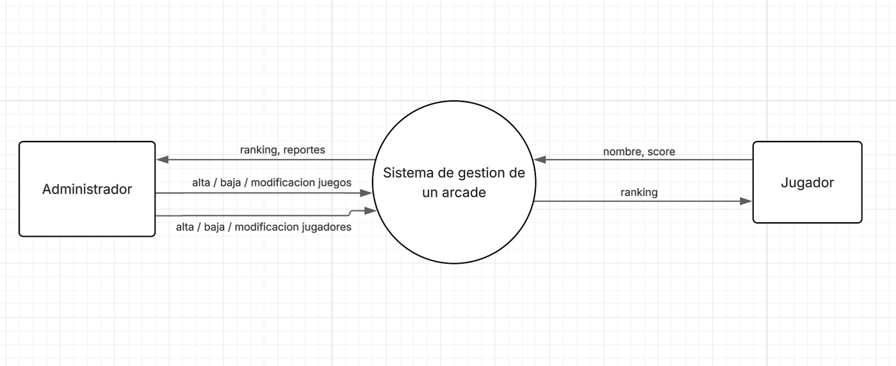
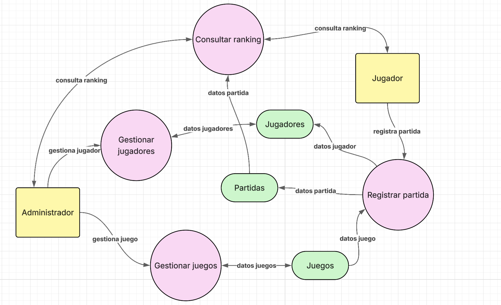
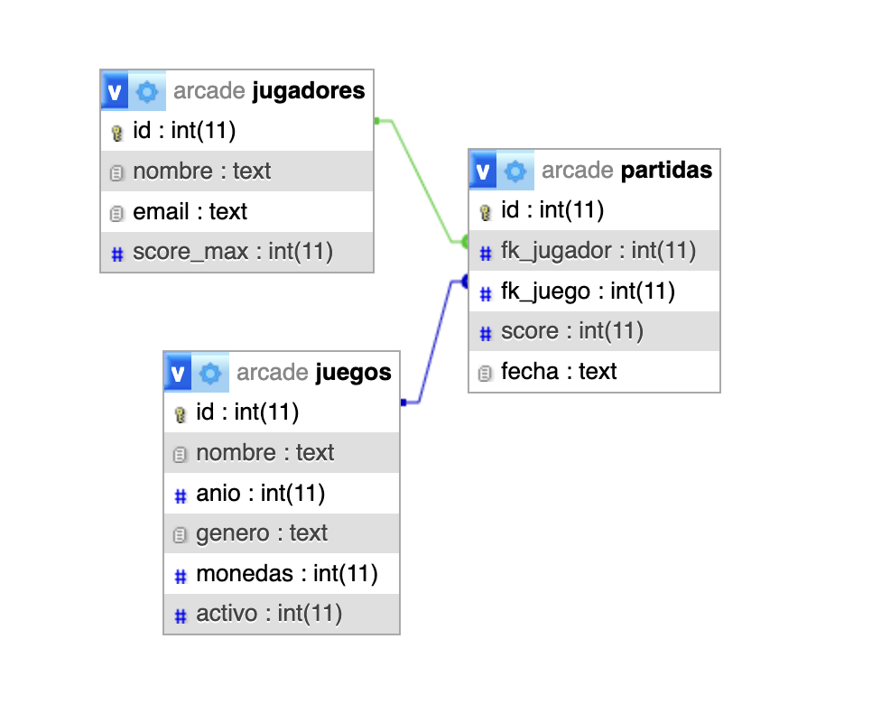

### 🕹️ Arcade – Aplicación en Python

-
Este proyecto fue desarrollado como parte de la carrera **Analista en Sistemas** en la **Escuela DaVinci**, dentro de la materia **Análisis y metodología de sistemas**, con el objetivo de analizar y desarrollar un sistema de utilizando Python y tkinter, la librería para aplicaciones de escritorio.

---

### 🎯 Objetivo del proyecto

Diseñar y desarrollar un **sistema de gestión simple** que simule el funcionamiento básico (CRUD) de un arcade. Comprender el funcionamiento y uso de Python como lenguaje.

---

### ✨ Características

- Gestión de jugadores y juegos
- CRUD de estas entidades principales
- Diseño de interfaz
- Conexión con base de datos
- Estructura MVC  

---

### 🛠️ Tecnologías utilizadas

- **Python**
- **Interfaz con tkinter**
- **Base de datos relacional (SQLite)**

---

### 📁 Contenido del repositorio

- Estructura organizada en Modelo-Vista-Controlador
- Documentación (diagramas)

---

### 🧪 Entorno de ejecución

Proyecto desarrollado y ejecutado en **entorno local**, como aplicación académica, sin fines productivos.

---

### 📌 Estado del proyecto

✅ Proyecto académico finalizado.

---

### Diagrama de contexto

### Diagrama DFD nivel 1

### Diccionario de datos

### Diagrama DER

